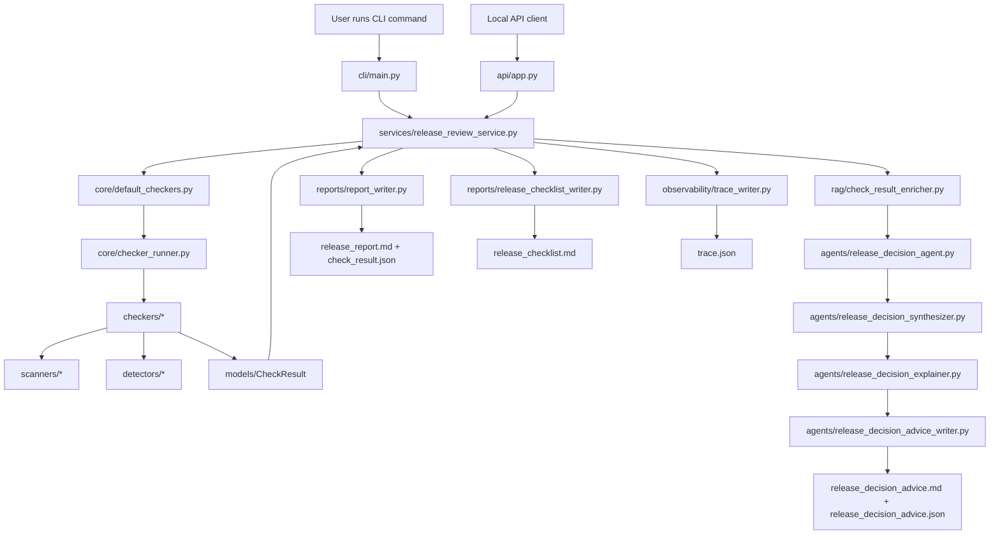

# ReleaseGuard Agent Current Architecture

This document describes the current architecture of ReleaseGuard Agent.

ReleaseGuard Agent is currently a CLI-and-API pre-release review system for
Python, FastAPI, and Flask projects. It runs deterministic release-readiness
checks, enriches findings with local rule evidence, produces deterministic
release decision advice, and writes review artifacts for humans and automation.

The current architecture is intentionally deterministic. It does not require
live LLM calls, embeddings, a vector database, or network access.

## Current scope

Phase-one supported project types:

- `python-generic`
- `fastapi`
- `flask`

Not supported in phase one:

- Django
- Celery
- Node.js
- Java
- Go
- Mobile projects
- Embedded projects

Current entry points:

```powershell
$env:PYTHONPATH = "src"
.venv\Scripts\python.exe -m releaseguard_agent.cli.main
.venv\Scripts\python.exe -m uvicorn releaseguard_agent.api.app:app --host 127.0.0.1 --port 8000
```

The project does not yet have installable package metadata, so direct CLI use
from a fresh PowerShell session requires `PYTHONPATH=src`.

## High-level architecture



## Main package layout

```text
src/releaseguard_agent/
|-- agents/
|-- api/
|-- checkers/
|-- cli/
|-- core/
|-- detectors/
|-- memory/
|-- models/
|-- observability/
|-- plugins/
|-- rag/
|-- reports/
|-- scanners/
|-- services/
`-- utils/
```

## Module responsibilities

| Module | Responsibility |
| --- | --- |
| `cli/` | CLI argument parsing, presentation, and exit-code mapping. |
| `services/` | Product-neutral review orchestration shared by current and future entry points. |
| `core/` | Checker runner orchestration and default checker composition. |
| `checkers/` | Release-readiness checks for Python, FastAPI, Flask, Docker, env files, and tests. |
| `scanners/` | Lower-level file scanners used by checkers. |
| `detectors/` | Framework/project signal detection, such as FastAPI and Flask signals. |
| `models/` | Shared data models such as `CheckResult` and rule evidence records. |
| `rag/` | Local deterministic rule retrieval and check-result enrichment. |
| `agents/` | Deterministic release decision synthesis, explanation, advice service, and advice writers. |
| `reports/` | Markdown/JSON release reports and release checklist artifact writers. |
| `observability/` | Deterministic trace artifact writer. |
| `api/` | Synchronous FastAPI routes, strict request/response models, path policy, and uniform errors. |
| `plugins/` | Reserved for future ecosystem/plugin expansion. |
| `memory/` | Reserved for future run history or memory-related features. |
| `services/` | Reserved for future service orchestration layer. |
| `utils/` | Reserved for shared utilities. |

## End-to-end CLI flow

A full CLI run follows this flow:

```text
1. User runs `releaseguard check`.
2. CLI calls `ReleaseReviewService.review()`.
3. The service resolves and validates the target project path and builds the default runner.
4. Checker runner executes all configured checkers exactly once.
5. Each checker returns one or more `CheckResult` objects.
6. The service builds a summary from the check results.
7. The service optionally writes:
   - release report artifacts
   - release checklist artifacts
   - Agent advice artifacts
   - trace artifacts
8. CLI prints the service result as text or JSON.
9. CLI returns an exit code:
   - 0 if no blocking issues exist
   - 1 if blocking issues exist
   - 2 for usage errors
```

## Current artifact pipeline

A complete run can produce these artifacts:

| Artifact | Writer | Purpose |
| --- | --- | --- |
| `release_report.md` | `reports/report_writer.py` | Human-readable release readiness report. |
| `check_result.json` | `reports/report_writer.py` | Machine-readable raw check result payload. |
| `release_checklist.md` | `reports/release_checklist_writer.py` | Operator-facing checklist grouped by blockers, warnings, passed checks, and skipped checks. |
| `release_decision_advice.md` | `agents/release_decision_advice_writer.py` | Human-readable deterministic release decision advice. |
| `release_decision_advice.json` | `agents/release_decision_advice_writer.py` | Machine-readable release decision advice payload. |
| `trace.json` | `observability/trace_writer.py` | Observability trace for command arguments, inputs, outputs, environment summary, and decision summary. |

## CLI artifact flags

The current CLI supports these artifact output flags:

| Flag | Output |
| --- | --- |
| `--output-dir` | `release_report.md`, `check_result.json` |
| `--checklist-output-dir` | `release_checklist.md` |
| `--agent-advice-output-dir` | `release_decision_advice.md`, `release_decision_advice.json` |
| `--trace-output-dir` | `trace.json` |

Example full command:

```powershell
.venv\Scripts\python.exe -m releaseguard_agent.cli.main check sample_projects\clean_python_project --format json --output-dir outputs\demo-report --checklist-output-dir outputs\demo-checklist --agent-advice-output-dir outputs\demo-advice --trace-output-dir outputs\demo-trace
```

## Core execution layer

The core execution layer is responsible for composing and running checkers.

Important files:

```text
src/releaseguard_agent/core/default_checkers.py
src/releaseguard_agent/core/checker_runner.py
```

`default_checkers.py` builds the current default Python checker set.

`checker_runner.py` runs checkers against a project path and collects
`CheckResult` objects.

The runner does not decide release status by itself. It only executes checks
and returns structured results.

## Checker layer

Checkers inspect the target project and return structured results.

Current checker groups:

```text
src/releaseguard_agent/checkers/python/
src/releaseguard_agent/checkers/common/
src/releaseguard_agent/checkers/fastapi/
src/releaseguard_agent/checkers/flask/
```

Current checker categories include:

- dependency declaration checks
- env example checks
- test structure checks
- pytest configuration checks
- optional pytest execution checks
- FastAPI signal checks
- Flask signal checks
- Docker readiness checks
- Dockerfile style checks

Each checker returns `CheckResult` records with:

- checker name
- status
- risk level
- title
- message
- evidence
- recommendation
- rule ID
- optional rule source
- optional file path
- metadata

## Data model layer

Important files:

```text
src/releaseguard_agent/models/check_result.py
src/releaseguard_agent/models/rule_evidence.py
```

`CheckResult` is the central result model for release checks.

Important fields include:

- `checker_name`
- `status`
- `risk_level`
- `title`
- `message`
- `evidence`
- `recommendation`
- `rule_id`
- `rule_source`
- `file_path`
- `metadata`

The release-blocking policy currently lives in:

```text
CheckResult.should_block_release
```

A check blocks release only when:

```text
status == failed
risk_level in {high, critical}
```

This blocking policy is reused by the deterministic Agent decision layer.

## Scanner and detector layer

Scanners and detectors provide reusable project inspection helpers.

Important files:

```text
src/releaseguard_agent/scanners/python_dependency_scanner.py
src/releaseguard_agent/scanners/dockerfile_scanner.py
src/releaseguard_agent/detectors/fastapi_detector.py
src/releaseguard_agent/detectors/flask_detector.py
```

Scanners focus on lower-level file parsing or file inspection.

Detectors focus on identifying project/framework signals.

This separation keeps checkers easier to test and prevents every checker from
duplicating file parsing logic.

## RAG and rule evidence layer

Important files:

```text
src/releaseguard_agent/rag/rule_index_retriever.py
src/releaseguard_agent/rag/check_result_enricher.py
src/releaseguard_agent/models/rule_evidence.py
```

The current RAG layer is deterministic and local.

It does not use embeddings, a vector database, semantic search, or network
retrieval.

Current behavior:

1. Load local release rule knowledge.
2. Retrieve rule evidence by exact `rule_id`.
3. Attach rule evidence to check results.
4. Preserve provenance such as source documents, source URLs, and
   knowledge-file paths.

This layer prepares the project for future RAG/LLM use without requiring
non-deterministic behavior today.

## Agent release decision layer

Important files:

```text
src/releaseguard_agent/agents/release_decision_agent.py
src/releaseguard_agent/agents/release_decision_synthesizer.py
src/releaseguard_agent/agents/release_decision_explainer.py
src/releaseguard_agent/agents/release_decision_advisor.py
src/releaseguard_agent/agents/release_decision_advice_service.py
src/releaseguard_agent/agents/release_decision_advice_writer.py
src/releaseguard_agent/agents/release_decision_workflow.py
src/releaseguard_agent/agents/release_risk_analysis_agent.py
src/releaseguard_agent/agents/release_risk_analysis_service.py
src/releaseguard_agent/agents/release_risk_analysis_writer.py
src/releaseguard_agent/llm/client.py
src/releaseguard_agent/llm/fake_client.py
src/releaseguard_agent/llm/openai_client.py
```

The CLI-connected Agent decision layer is deterministic and does not call an
LLM. The repository also contains a standalone LLM risk-analysis Agent,
artifact writer, and service. Those components use an injected `LLMClient` but
are not called by the CLI or another product entry point.

Current responsibilities:

- enrich checker results with rule evidence
- synthesize a release decision
- group blockers and warnings
- preserve missing-evidence information
- produce human-readable explanation text
- write advice artifacts as Markdown and JSON

The Agent layer explains the release state, but it does not invent a separate
release-blocking policy. It reuses `CheckResult.should_block_release`.

## Report and checklist layer

Important files:

```text
src/releaseguard_agent/reports/report_writer.py
src/releaseguard_agent/reports/release_checklist_writer.py
src/releaseguard_agent/reports/__init__.py
```

The report writer produces:

```text
release_report.md
check_result.json
```

The checklist writer produces:

```text
release_checklist.md
```

The checklist groups check results into:

- blocking fixes
- warnings to review
- passed checks
- skipped checks

The reports package also exposes stable public imports through:

```text
releaseguard_agent.reports
```

This avoids requiring callers to import directly from internal writer modules.

## Observability layer

Important files:

```text
src/releaseguard_agent/observability/trace_writer.py
src/releaseguard_agent/observability/__init__.py
```

The trace writer produces:

```text
trace.json
```

The trace payload records:

- tool name
- artifact type
- schema version
- run ID
- created timestamp
- project path
- command arguments
- environment summary
- input artifact references
- output artifact references
- decision summary

When report, checklist, Agent advice, and trace outputs are requested
together, `trace.json` references all generated artifact paths.

## Public API surfaces

The project currently exposes several package-level public API surfaces:

```text
releaseguard_agent.agents
releaseguard_agent.llm
releaseguard_agent.rag
releaseguard_agent.reports
releaseguard_agent.observability
```

These public exports make future CLI/API/docs integrations safer because
external callers do not need to depend on concrete internal module paths.

## Deterministic design boundaries

The current implementation intentionally keeps these behaviors deterministic:

- checker execution
- rule evidence lookup
- release decision synthesis
- release decision explanation
- report writing
- checklist writing
- trace writing

The current product entry points intentionally avoid:

- automatic live LLM calls
- embeddings
- vector databases
- network retrieval
- hidden release-blocking policy changes

This keeps unit tests and integration tests stable.

## Reserved future extension points

The architecture reserves space for future expansion.

### API layer

Implemented package:

```text
src/releaseguard_agent/api/
```

Current synchronous API endpoints:

```text
GET /health
POST /reviews
POST /verifications
```

`GET /health` and `POST /reviews` are operational. `POST /reviews` resolves the
target through `ProjectPathPolicy` and delegates to `ReleaseReviewService`.
`POST /verifications` returns a structured 501 until M6 implements a real
before/after comparison; it is not counted as a completed repair loop.

### Plugin layer

Reserved package:

```text
src/releaseguard_agent/plugins/
```

Future plugin work may add support for ecosystems beyond Python/FastAPI/Flask.

Potential future ecosystems:

- Node.js
- Java
- Go

These are not claimed as current support.

### Memory/history layer

Reserved package:

```text
src/releaseguard_agent/memory/
```

Future memory or history work may store run history, report metadata, or
previous decisions.

### Services layer

Implemented package:

```text
src/releaseguard_agent/services/
```

`ReleaseReviewService` is the current business boundary. It validates one
project path, executes one checker pass, aggregates deterministic results, and
coordinates report, checklist, advice, and trace artifacts. M2 can reuse this
service from FastAPI without copying CLI business logic.

## Test strategy

The current test suite includes:

```text
tests/unit/
tests/integration/
```

Unit tests cover:

- models
- scanners
- detectors
- checkers
- runner behavior
- report writers
- checklist writer
- trace writer
- RAG and rule evidence
- deterministic Agent decision/advice behavior
- CLI behavior

Integration tests cover:

- real CLI subprocess execution
- sample projects
- generated report artifacts
- generated checklist artifacts
- Agent advice artifacts
- trace artifacts
- exit-code behavior

## Current architecture summary

ReleaseGuard Agent currently follows this architecture:

```text
CLI or FastAPI `/reviews`
 -> ReleaseReviewService
 -> default checker runner
 -> deterministic checkers
 -> CheckResult records
 -> report/checklist artifacts
 -> deterministic RAG evidence enrichment
 -> deterministic Agent release decision advice
 -> observability trace artifact
```

This gives the project a working phase-one release-review pipeline while
keeping the architecture open for future API, plugin, persistence, and richer
RAG/LLM capabilities.

Separately, a provider-neutral LLM boundary, fake client, standalone risk
analysis Agent/service, and OpenAI-compatible adapter are available for
offline-tested development. They are not part of the CLI flow shown above and
do not establish production LLM integration by themselves.
